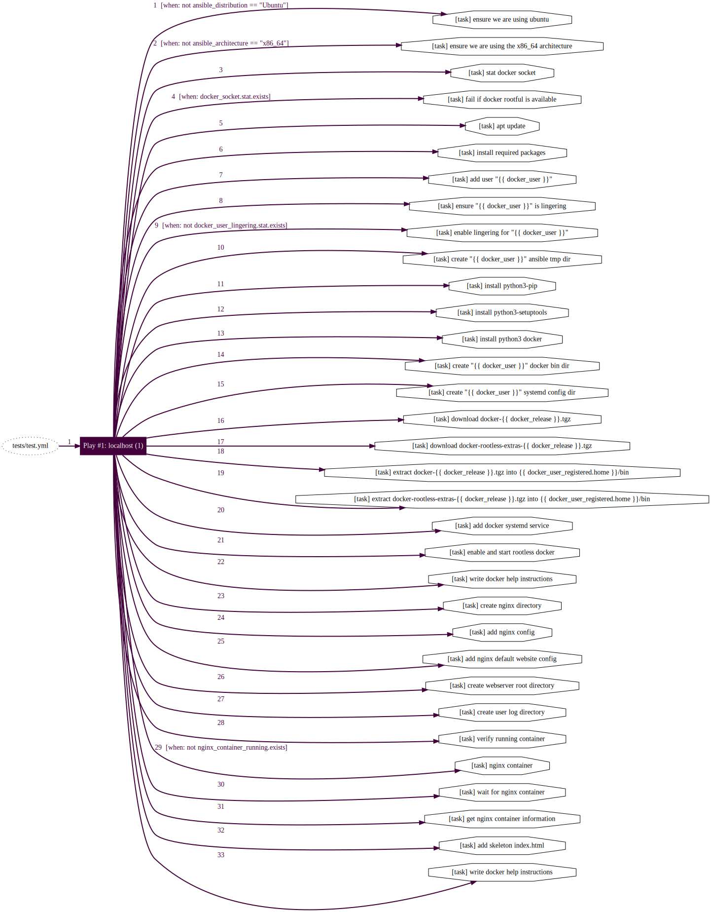
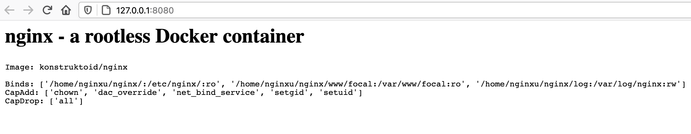

# Running a NGINX container using rootless Docker with Ansible

An [Ansible](https://www.ansible.com/) example to install a rootless
[Docker](https://www.docker.com/) server and start a [NGINX](https://www.nginx.com/)
container.

```shell
Do not use any of this without first testing in a non-operational environment.
```



## The Security Layers

> Rootless mode allows running the Docker daemon and containers as a non-root
user to mitigate potential vulnerabilities in the daemon and the container
runtime.

In this example we'll name the user `nginxu`, since it will only run the NGINX
container.

In addition to creating a dedicated NGINX container user running a rootless
Docker daemon, we'll also reduce the number of [kernel capabilites](https://docs.docker.com/engine/security/#linux-kernel-capabilities)
available to the container.

The user running the daemon can of course run multiple containers,
or we can create multiple users running multiple instances of the Docker daemon.

## The Variables: rootfull, user name and Docker release

Since the point with this repository is to get a rootless Docker server and a
basic web container up and running, we'll be ignoring most of the configuration
options and only focusing on the most relevant parts: the user that will run
the service and how to get the Docker binaries if you don't want to install a
rootful daemon.

In `./defaults/main.yml` we first choose if we want to install Docker using
`.deb` packages, also known as the "rootful" installation since it requires
`root` permissions and installs the upstream Docker daemon or download the
static binaries and do a manual install.

If we set `docker_rootful: false` we will download the static binaries and do
a manual install, not requiring any `root` permissions.

We then define the name of the Docker user that will be created with the
`docker_user` variable. This user will download and install the binaries if
`docker_rootful: false` or else the user will be the one running the container.

The `docker_url` and `docker_release` variables defines where we find the
relevant binaries and which version we should use when doing a manual
installation.

`docker_release_shasum` and `docker_release_rootless_shasum` are used to verify
the files when downloaded using the [get_url](https://docs.ansible.com/ansible/latest/collections/ansible/builtin/get_url_module.html)
module.

```yaml
docker_rootful: false
docker_user: nginxu
docker_url: "https://download.docker.com/linux/static/stable/x86_64"
docker_release: "20.10.2"
docker_release_shasum: "97017e32a8ecbdd1826bb3c7b1424303ee0dea3f900d33591b1df5e394ed4eed"
docker_release_rootless_shasum: "4ebdad1d4743ccca68d183fccdb978aa8b62e7b24743fff36099bd29e46380e0"
```

## The Tasks: user creation, Docker installation and container management

> All tasks, templates and related code are available in this repository and can
be tested and tried using [Ansible Molecule](https://molecule.readthedocs.io/en/latest/)
with the [molecule-vagrant](https://github.com/ansible-community/molecule-vagrant)
plugin.

### User creation and systemd lingering

Using the [user](https://docs.ansible.com/ansible/latest/collections/ansible/builtin/user_module.html)
module we create the `{{ docker_user }}`, and also the `docker_user_registered`
variable. `docker_user_registered` will be used as a easy way to get the
`{{ docker_user }}` environment settings.

It's probably not in any way optimal using registered variables in this way,
using [set_fact](https://docs.ansible.com/ansible/latest/collections/ansible/builtin/set_fact_module.html)
might be more suitable in a more production like environment.

```yaml
- name: add user "{{ docker_user }}"
  become: 'yes'
  user:
    name: "{{ docker_user }}"
    state: present
    shell: /bin/bash
  register: docker_user_registered
```

Since we created a non-system user we need to ensure that any user processes
aren't killed due to a missing login session.

> Enabling lingering means that user@.service is started automatically during
boot, even if the user is not logged in, and that the service is not terminated
when the user logs out. Enabling lingering allows the user to run processes
without being logged in. ([systemd-run](https://www.freedesktop.org/software/systemd/man/systemd-run.html))

```yaml
- name: ensure "{{ docker_user }}" is lingering
  stat:
    path: "/var/lib/systemd/linger/{{ docker_user }}"
  register: docker_user_lingering

- name: enable lingering for "{{ docker_user }}"
  become: 'yes'
  command: "loginctl enable-linger {{ docker_user }}"
  when: not docker_user_lingering.stat.exists
```

### User directories

Since we are installing the Docker daemon in a directory owned by
`{{ docker_user }}`, in this example the user home directory, we also
need to create the required Ansible, Docker and systemd directories.

Note that we use `become_user: "{{ docker_user }}"` and the
`{{ docker_user_registered.home }}` variable to create the directories
with the correct ownership and locations.

```yaml
- name: create "{{ docker_user }}" ansible tmp dir
  become: 'yes'
  become_user: "{{ docker_user }}"
  file:
    path: "{{ docker_user_registered.home }}/.ansible/tmp"
    state: directory
    mode: "0700"

- name: create "{{ docker_user }}" docker bin dir
  become: 'yes'
  become_user: "{{ docker_user }}"
  file:
    path: "{{ docker_user_registered.home }}/bin"
    state: directory
    mode: "0700"

- name: create "{{ docker_user }}" systemd config dir
  become: 'yes'
  become_user: "{{ docker_user }}"
  file:
    path: "{{ docker_user_registered.home }}/.config/systemd/user"
    state: directory
    mode: "0700"
```

### Manual Docker installation

After creating the necessary directories we, download the packages defined by
`url: "{{ docker_url }}/docker-{{ docker_release }}.tgz"` and
`url: "{{ docker_url }}/docker-rootless-extras-{{ docker_release }}.tgz"`
and verify them using the [get_url](https://docs.ansible.com/ansible/latest/collections/ansible/builtin/get_url_module.html)
module.

```yaml
- name: download docker-{{ docker_release }}.tgz
  become: 'yes'
  become_user: "{{ docker_user }}"
  get_url:
    url: "{{ docker_url }}/docker-{{ docker_release }}.tgz"
    dest: "{{ docker_user_registered.home }}/docker-{{ docker_release }}.tgz"
    checksum: "sha256:{{ docker_release_shasum }}"

- name: download docker-rootless-extras-{{ docker_release }}.tgz
  become: 'yes'
  become_user: "{{ docker_user }}"
  get_url:
    url: "{{ docker_url }}/docker-rootless-extras-{{ docker_release }}.tgz"
    dest: "{{ docker_user_registered.home }}/docker-rootless-extras-{{ docker_release }}.tgz"
    checksum: "sha256:{{ docker_release_rootless_shasum }}"
```

Extracting the downloaded packages are done by the [unarchive](https://docs.ansible.com/ansible/latest/collections/ansible/builtin/unarchive_module.html)
module, with the `{{ docker_user_registered.home }}/bin` directory as a destination.

```yaml
- name: extract docker-{{ docker_release }}.tgz into {{ docker_user_registered.home }}/bin
  become: 'yes'
  become_user: "{{ docker_user }}"
  unarchive:
    src: "{{ docker_user_registered.home }}/docker-{{ docker_release }}.tgz"
    dest: "{{ docker_user_registered.home }}/bin"
    extra_opts:
      - --strip-components=1
    remote_src: 'yes'

- name: extract docker-rootless-extras-{{ docker_release }}.tgz into {{ docker_user_registered.home }}/bin
  become: 'yes'
  become_user: "{{ docker_user }}"
  unarchive:
    src: "{{ docker_user_registered.home }}/docker-rootless-extras-{{ docker_release }}.tgz"
    dest: "{{ docker_user_registered.home }}/bin"
    extra_opts:
      - --strip-components=1
    remote_src: 'yes'
```

The rootless Docker systemd service file requires some modifications before the
daemon can be managed. We use the previously created `docker_user_registered`
variable to set the correct environment values and `ExecStart` setting in the
`docker.service` template before rendering the template in the
`{{ docker_user_registered.home }}/.config/systemd/user/`
directory.

```sh
Environment="DOCKER_HOST=unix:///run/user/{{ docker_user_registered.uid }}/docker.sock"
Environment="PATH={{ docker_user_registered.home }}/bin:/usr/local/sbin:/usr/local/bin:/usr/sbin:/usr/bin:/sbin:/bin"
Environment="XDG_RUNTIME_DIR=/run/user/{{ docker_user_registered.uid }}"
ExecStart="{{ docker_user_registered.home }}/bin/dockerd-rootless.sh"
```

```yaml
- name: add docker systemd service
  become: 'yes'
  become_user: "{{ docker_user }}"
  template:
    src: docker.service.j2
    dest: "{{ docker_user_registered.home }}/.config/systemd/user/docker.service"
    backup: 'yes'
    mode: 0600
```

The `docker.service` is enabled and started using the [systemd](https://docs.ansible.com/ansible/latest/collections/ansible/builtin/systemd_module.html)
module. In addition to using `become: 'yes'` and
`become_user: "{{ docker_user }}"`, we need to set `scope: user`.

```yaml
- name: enable and start rootless docker
  become: 'yes'
  become_user: "{{ docker_user }}"
  systemd:
    name: docker.service
    enabled: 'yes'
    state: started
    scope: user
    daemon_reload: 'yes'
```

### Package Docker installation

If we're installing using `apt`, we'll only need to install
the `docker-ce` and `docker-ce-rootless-extras` packages.

```yaml
- name: install docker
  become: 'yes'
  apt:
    name: ['docker-ce', 'docker-ce-rootless-extras']
    state: present
```

After installation, we'll disable the rootful Docker daemon
since our priority is reducing any attack surface and the usage
of `root` privileges.

```yaml
- name: disable rootful docker daemon
  become: 'yes'
  systemd:
    name: docker
    state: stopped
    enabled: 'no'
  tags:
    - docker
```

We then install the rootless Docker daemon as the `{{ docker_user }}` unless
`/run/user/{{ docker_user_registered.uid }}/docker.sock` exists.

```yaml
- name: stat {{ docker_user_registered.uid }}/docker.sock
  become: 'yes'
  become_user: "{{ docker_user }}"
  stat:
    path: "/run/user/{{ docker_user_registered.uid }}/docker.sock"
  register: docker_rootless_sock

- name: install rootless docker
  become: 'yes'
  become_user: "{{ docker_user }}"
  command: dockerd-rootless-setuptool.sh install
  when: not docker_rootless_sock.stat.exists
```

After the installation we enable and start the daemon.

```yaml
- name: enable and start rootless docker
  become: 'yes'
  become_user: "{{ docker_user }}"
  systemd:
    name: docker.service
    enabled: 'yes'
    state: started
    scope: user
    daemon_reload: 'yes'
```

### Container management

Running containers is not that much different from when a rootful Docker daemon
is used, but we still need to become the unprivileged user and adapt any paths
to the user working directory.

The tasks required to create the below mentioned directories are available in
the repository but not shown in this document.

```yaml
- name: add nginx default website config
  become: 'yes'
  become_user: "{{ docker_user }}"
  template:
    src: default.conf.j2
    dest: "{{ docker_user_registered.home }}/nginx/conf.d/default.conf"
    mode: 0644
```

The container is managed by the [docker_container](https://docs.ansible.com/ansible/latest/collections/community/general/docker_container_module.html)
module. Using [read-only volumes](https://docs.docker.com/storage/volumes/#use-a-read-only-volume)
and only allow a subset of kernel capabilites, we further reduce any potential
attack surface.

```yaml
- name: nginx container
  become: 'yes'
  become_user: "{{ docker_user }}"
  docker_container:
    name: nginx
    image: konstruktoid/nginx
    state: started
    restart: 'yes'
    ports:
      - "8080:80"
    cap_drop: all
    capabilities:
      - chown
      - dac_override
      - net_bind_service
      - setgid
      - setuid
    volumes:
      - "{{ docker_user_registered.home }}/nginx/:/etc/nginx/:ro"
      - "{{ docker_user_registered.home }}/nginx/www/{{ ansible_hostname }}:/var/www/{{ ansible_hostname }}:ro"
      - "{{ docker_user_registered.home }}/nginx/log:/var/log/nginx"
    pull: 'yes'
    restart_policy: on-failure
    restart_retries: 3
    hostname: "{{ ansible_nodename }}"
    container_default_behavior: compatibility
```

## The Result: Running molecule

If [Ansible Molecule](https://molecule.readthedocs.io/en/latest/)
with the [molecule-vagrant](https://github.com/ansible-community/molecule-vagrant)
plugin and related software is installed, running
`molecule test --destroy never` should allow you to visit
[http://127.0.0.1:8080](http://127.0.0.1:8080) after all tasks and the full test
sequence has finished.



## Contributing

Do you want to contribute? Great! Contributions are always welcome,
no matter how large or small. If you found something odd, feel free to submit a
issue, improve the code by creating a pull request, or by
[sponsoring this project](https://github.com/sponsors/konstruktoid).

## License

Apache License Version 2.0

## Author Information

[https://github.com/konstruktoid](https://github.com/konstruktoid "github.com/konstruktoid")
